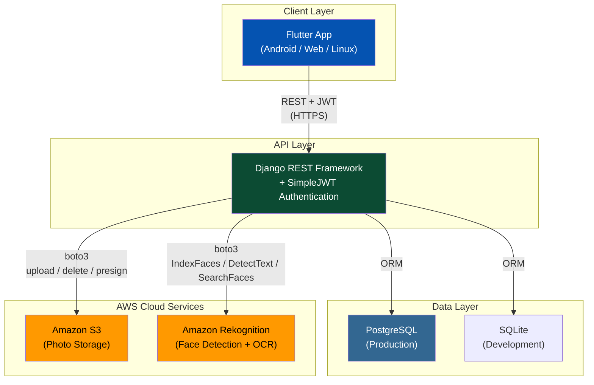
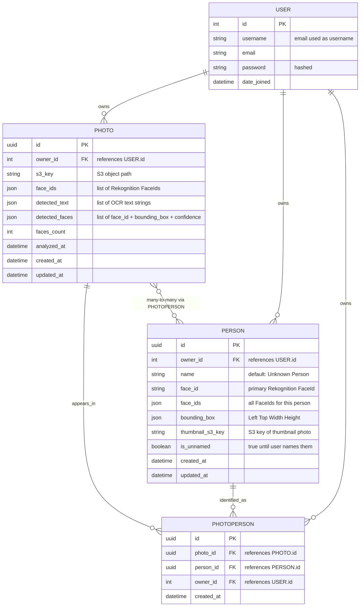
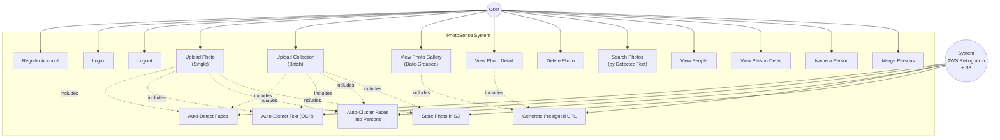
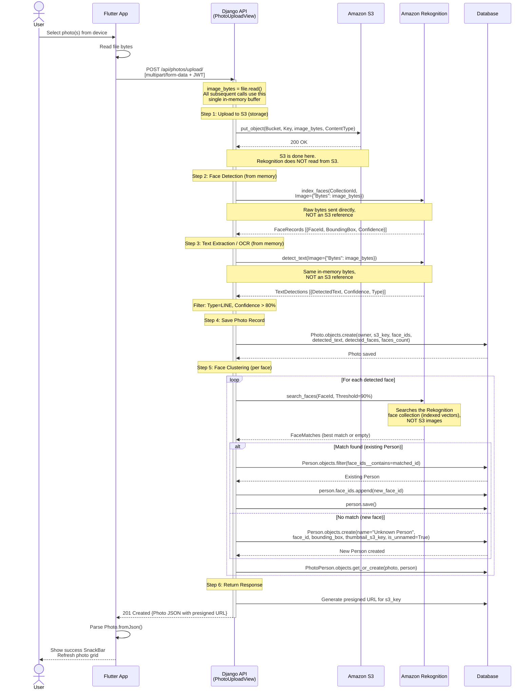
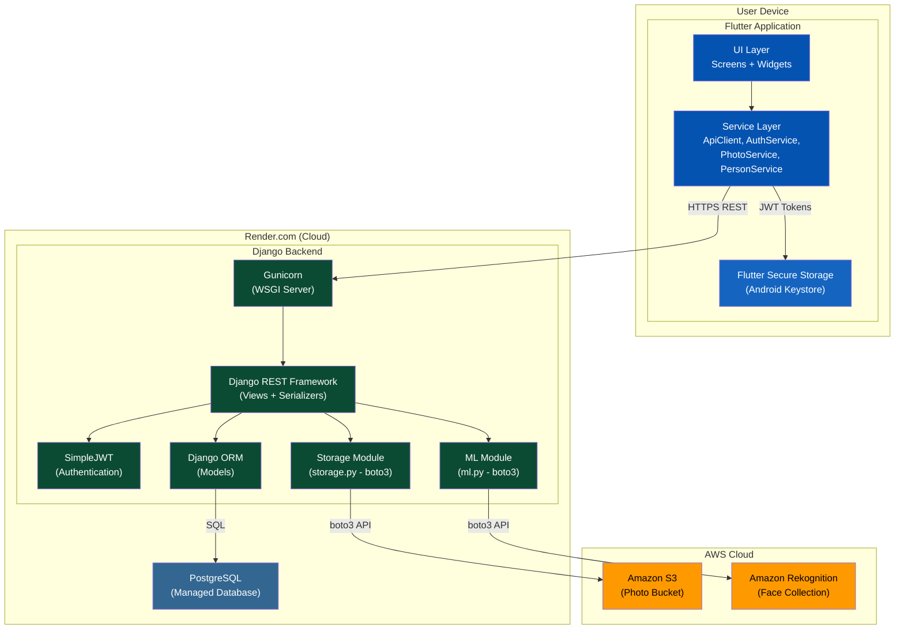

# PhotoSense - Presentation Document

> **Project**: PhotoSense - Intelligent Photo Gallery  
> **Stack**: Flutter (Frontend) + Django REST Framework (Backend) + AWS Rekognition (ML)  
> **Repository Branch**: `main` (Django migration merged)

---

## Table of Contents

1. [Problem Statement](#1-problem-statement)
2. [Proposed Solution](#2-proposed-solution)
3. [SDG Goals](#3-sdg-goals)
4. [UML Diagrams](#4-uml-diagrams)
   - 4.1 [ER Diagram](#41-er-diagram-entity-relationship)
   - 4.2 [Class Diagram](#42-class-diagram)
   - 4.3 [Use Case Diagram](#43-use-case-diagram)
   - 4.4 [Sequence Diagram - Photo Upload](#44-sequence-diagram---photo-upload-flow)
   - 4.5 [Component / Deployment Diagram](#45-component--deployment-diagram)
5. [Project Document - Application Pages](#5-project-document---application-pages)
   - 5.1 [Splash / Auth Check Screen](#51-splash--auth-check-screen)
   - 5.2 [Login Page](#52-login-page)
   - 5.3 [Sign Up Page](#53-sign-up-page)
   - 5.4 [Home / Landing Page](#54-home--landing-page)
   - 5.5 [Photo Detail Page](#55-photo-detail-page)
   - 5.6 [People Page](#56-people-page)
   - 5.7 [Person Detail Page](#57-person-detail-page)
   - 5.8 [Search Page](#58-search-page)

---

## 1. Problem Statement

Managing and organizing large personal photo collections is a time-consuming and entirely manual process. Users must manually tag, categorize, and scroll through hundreds or thousands of photos to locate specific images. Current mainstream gallery applications (Google Photos, Apple Photos, Samsung Gallery) offer AI-powered features but come with significant trade-offs:

- **Vendor Lock-in**: Intelligent features are tied to proprietary ecosystems. Users cannot self-host or control the processing pipeline.
- **Privacy Concerns**: Photos are uploaded to third-party cloud servers for processing, with limited transparency about data usage.
- **Cost at Scale**: Free tiers are restricted; advanced features require premium subscriptions.
- **No Cross-Platform Parity**: Native AI gallery features are platform-specific (iOS-only, Android-only) and do not work on web or desktop.

There is no affordable, open-source, cross-platform solution that combines **automatic face recognition**, **OCR text extraction**, and **intelligent search** in a self-hosted personal photo gallery application.

### Key Challenges Addressed

| Challenge | Description |
|-----------|-------------|
| **Manual Organization** | Users spend hours manually tagging and sorting photos by person or event |
| **Finding Specific Photos** | No way to search photos by text visible in images (signs, documents, whiteboards) |
| **Face Identification** | Manually identifying and grouping photos by the people who appear in them |
| **Cross-Platform Access** | Need to access the same intelligent gallery from mobile, web, and desktop |
| **Data Ownership** | Users want control over where their photos are stored and processed |

---

## 2. Proposed Solution

**PhotoSense** is an intelligent photo gallery application that automatically detects faces and text in uploaded photos using AI/ML services. It provides a cross-platform Flutter frontend backed by a Django REST API, enabling users to upload, organize, search, and manage their photos with minimal manual effort.

### Architecture Overview



### Technology Stack

| Layer | Technology | Purpose |
|-------|-----------|---------|
| **Frontend** | Flutter 3.x (Dart) | Cross-platform UI (Android, Web, Linux) |
| **Backend** | Django 4.2 + Django REST Framework | REST API, business logic, data modeling |
| **Authentication** | SimpleJWT | JWT token-based auth (1-day access, 30-day refresh) |
| **Database** | PostgreSQL (prod) / SQLite (dev) | Relational data storage |
| **File Storage** | Amazon S3 | Photo binary storage with presigned URLs |
| **ML / AI** | Amazon Rekognition | Face detection, face indexing, OCR text extraction |
| **Deployment** | Render.com | Backend hosting (gunicorn) |
| **Security** | Flutter Secure Storage | JWT tokens stored in Android Keystore |

### Key Features

| Feature | Description |
|---------|-------------|
| **User Authentication** | Email/password registration and login with JWT tokens |
| **Photo Upload** | Single and batch photo upload with progress feedback |
| **Automatic Face Detection** | Uploaded photos are analyzed via AWS Rekognition IndexFaces |
| **Automatic OCR** | Text in photos is extracted via AWS Rekognition DetectText (>80% confidence) |
| **Face Clustering** | Detected faces are automatically grouped into Person entities using face similarity matching (90% threshold) |
| **Person Management** | Name unknown persons, merge duplicate person entries |
| **Intelligent Search** | Server-side search by detected text content (icontains query) |
| **Date-Grouped Gallery** | Photos organized by upload date with sticky headers (Today, Yesterday, date) |
| **Per-User Isolation** | All queries are owner-scoped; users can only see their own data |
| **Global 401 Handling** | Expired tokens are caught globally and user is redirected to sign-in |
| **Material 3 Design** | Deep Purple seed color, Google Fonts (Inter), light and dark theme support |

### Migration Context (Amplify to Django)

PhotoSense was originally built on AWS Amplify (Cognito + AppSync + DynamoDB + Lambda + S3). The backend was migrated to Django REST Framework to:

1. **Simplify the stack** - Replace 5 Amplify services with a single Django server
2. **Improve upload flow** - Single-call upload vs. 3-step Amplify upload (getUrl -> uploadFile -> createPhoto)
3. **Enable server-side search** - Replace client-side full-scan with Django ORM queries
4. **Academic requirement** - Course professor recommended Django as the backend framework

---

## 3. SDG Goals

PhotoSense aligns with the following United Nations Sustainable Development Goals:

### SDG 4: Quality Education

```
Goal 4: Ensure inclusive and equitable quality education and promote
        lifelong learning opportunities for all.
```

| Aspect | Alignment |
|--------|-----------|
| **Academic Learning Tool** | Built as a course project demonstrating integration of ML services (AWS Rekognition), REST API design (Django REST Framework), JWT security, and cross-platform mobile development (Flutter). |
| **Full-Stack Skill Development** | The project covers the complete software development lifecycle: frontend UI, backend API, database modeling, cloud service integration, authentication, and deployment. |
| **Open-Source Architecture** | The project's architecture and documentation serve as a reference for students learning modern full-stack development with AI/ML integration. |
| **Technology Literacy** | Demonstrates how AI services (face recognition, OCR) can be integrated into practical applications, building digital literacy and technology awareness. |

**Target**: 4.4 - By 2030, substantially increase the number of youth and adults who have relevant skills, including technical and vocational skills, for employment, decent jobs and entrepreneurship.

---

### SDG 9: Industry, Innovation and Infrastructure

```
Goal 9: Build resilient infrastructure, promote inclusive and sustainable
        industrialization and foster innovation.
```

| Aspect | Alignment |
|--------|-----------|
| **AI/ML Integration** | Leverages Amazon Rekognition for intelligent, automated photo indexing - demonstrating how small-scale applications can use cloud AI services for innovation in personal data management. |
| **Innovative Face Clustering** | Automatic face clustering with similarity matching (90% threshold) groups detected faces into Person entities without manual tagging - a novel approach for personal gallery apps. |
| **Cloud-Native Architecture** | Uses modern cloud infrastructure (S3, Rekognition, Render.com) with a self-hosted backend, demonstrating scalable and resilient infrastructure patterns. |
| **Cross-Platform Innovation** | A single Flutter codebase targets Android, Web, and Linux - reducing development overhead and promoting inclusive access across platforms. |

**Target**: 9.5 - Enhance scientific research, upgrade the technological capabilities of industrial sectors, including encouraging innovation.

---

### SDG 16: Peace, Justice and Strong Institutions

```
Goal 16: Promote peaceful and inclusive societies for sustainable
         development, provide access to justice for all and build
         effective, accountable and inclusive institutions at all levels.
```

| Aspect | Alignment |
|--------|-----------|
| **Data Privacy** | Per-user data isolation ensures users can only access their own photos and person data. All database queries are owner-scoped (`Photo.objects.filter(owner=request.user)`). |
| **Secure Authentication** | JWT-based authentication with secure token storage (Android Keystore via Flutter Secure Storage). Tokens have defined lifetimes (1-day access, 30-day refresh). |
| **Presigned URL Security** | Photos are not publicly accessible. S3 presigned URLs are generated server-side with 7-day expiry, ensuring controlled and time-limited access. |
| **Global Unauthorized Access Handling** | 401 responses are intercepted globally in the Flutter app, clearing tokens and redirecting to sign-in - preventing unauthorized access to protected resources. |
| **Transparent Processing** | Unlike proprietary solutions, the processing pipeline is visible and auditable. Users know exactly what data is stored and how it is processed. |

**Target**: 16.10 - Ensure public access to information and protect fundamental freedoms, in accordance with national legislation and international agreements.

---

## 4. UML Diagrams

### 4.1 ER Diagram (Entity-Relationship)



**Key Relationships:**
- A `User` owns many `Photos` and many `Persons` (1:N)
- A `Photo` can contain many `Persons` (faces), and a `Person` can appear in many `Photos` (M:N)
- The `PhotoPerson` junction table resolves the many-to-many relationship with `unique_together(photo, person)`

---

### 4.2 Class Diagram

```mermaid
classDiagram
    direction TB

    class User {
        +int id
        +String username
        +String email
        +String password
        +DateTime date_joined
    }

    %% ===== DJANGO BACKEND CLASSES =====

    class Photo {
        +UUID id
        +ForeignKey owner
        +String s3_key
        +JSON face_ids
        +JSON detected_text
        +JSON detected_faces
        +int faces_count
        +DateTime analyzed_at
        +DateTime created_at
        +DateTime updated_at
        +__str__() String
    }

    class Person {
        +UUID id
        +ForeignKey owner
        +String name
        +String face_id
        +JSON face_ids
        +JSON bounding_box
        +String thumbnail_s3_key
        +bool is_unnamed
        +DateTime created_at
        +DateTime updated_at
        +__str__() String
    }

    class PhotoPerson {
        +UUID id
        +ForeignKey photo
        +ForeignKey person
        +ForeignKey owner
        +DateTime created_at
        +__str__() String
    }

    class PhotoSerializer {
        +SerializerMethodField url
        +get_url(obj) String
    }

    class PersonSerializer {
        +SerializerMethodField thumbnail_url
        +SerializerMethodField photos
        +get_thumbnail_url(obj) String
        +get_photos(obj) List
    }

    class PhotoUploadView {
        +MultiPartParser parser_classes
        +post(request) Response
    }

    class PhotoViewSet {
        +PhotoSerializer serializer_class
        +get_queryset() QuerySet
        +perform_destroy(instance) void
        +search(request) Response
    }

    class PersonViewSet {
        +PersonSerializer serializer_class
        +get_queryset() QuerySet
        +retrieve(request) Response
        +merge(request, pk) Response
    }

    class RegisterView {
        +AllowAny permission_classes
        +post(request) Response
    }

    class MLService {
        +ensure_collection() void
        +index_faces(image_bytes) List
        +detect_text(image_bytes) List
        +search_faces(face_id) String
    }

    class StorageService {
        +upload_to_s3(file_bytes, s3_key, content_type) void
        +delete_from_s3(s3_key) void
        +get_presigned_url(s3_key, expiry_seconds) String
    }

    %% ===== FLUTTER FRONTEND CLASSES =====

    class FlutterPhoto {
        +String id
        +String s3Key
        +String? url
        +List~String~ faceIds
        +List~String~ detectedText
        +List~Map~ detectedFaces
        +int facesCount
        +DateTime? analyzedAt
        +DateTime createdAt
        +DateTime? updatedAt
        +fromJson(Map json)$ FlutterPhoto
    }

    class FlutterPerson {
        +String id
        +String name
        +String faceId
        +List~String~ faceIds
        +Map? boundingBox
        +String? thumbnailS3Key
        +String? thumbnailUrl
        +bool isUnnamed
        +DateTime createdAt
        +DateTime? updatedAt
        +List~FlutterPhoto~? photos
        +fromJson(Map json)$ FlutterPerson
    }

    class ApiClient {
        -FlutterSecureStorage _storage
        +Function? onUnauthorized
        +saveTokens(access, refresh) Future
        +getAccessToken() Future~String~
        +clearTokens() Future
        +get(path) Future~Response~
        +post(path, body) Future~Response~
        +patch(path, body) Future~Response~
        +delete(path) Future~Response~
        +multipart(path, filePath, fieldName) Future~StreamedResponse~
    }

    class AuthService {
        +login(email, password)$ Future~String~
        +register(email, password)$ Future
        +logout()$ Future
        +isLoggedIn()$ Future~bool~
    }

    class PhotoService {
        +listPhotos()$ Future~List~
        +uploadPhoto(filePath)$ Future~FlutterPhoto~
        +deletePhoto(id)$ Future
        +search(query)$ Future~List~
    }

    class PersonService {
        +listPersons()$ Future~List~
        +getPerson(id)$ Future~FlutterPerson~
        +renamePerson(id, name)$ Future~FlutterPerson~
        +mergePerson(sourceId, targetId)$ Future
        +deletePerson(id)$ Future
    }

    %% ===== RELATIONSHIPS =====

    User "1" --> "*" Photo : owns
    User "1" --> "*" Person : owns
    Photo "1" --> "*" PhotoPerson : has
    Person "1" --> "*" PhotoPerson : has

    PhotoUploadView --> Photo : creates
    PhotoUploadView --> MLService : calls
    PhotoUploadView --> StorageService : calls
    PhotoViewSet --> PhotoSerializer : uses
    PersonViewSet --> PersonSerializer : uses

    AuthService --> ApiClient : uses
    PhotoService --> ApiClient : uses
    PersonService --> ApiClient : uses
    PhotoService --> FlutterPhoto : returns
    PersonService --> FlutterPerson : returns
```



---

### 4.3 Use Case Diagram



**Use Case Descriptions:**

| Use Case | Actor | Description |
|----------|-------|-------------|
| Register Account | User | Create a new account with email and password |
| Login | User | Authenticate with email/password, receive JWT tokens |
| Logout | User | Clear stored JWT tokens, redirect to sign-in |
| Upload Photo | User | Select and upload one or more photos from device |
| Upload Collection | User | Select multiple photos via file picker for batch upload |
| View Photo Gallery | User | Browse all photos in a date-grouped grid with sticky headers |
| View Photo Detail | User | See full photo, detected faces, detected text, metadata |
| Delete Photo | User | Permanently remove a photo (S3 + database) |
| Search Photos | User | Search by text detected in photos (server-side query) |
| View People | User | See grid of named people and horizontal list of unnamed faces |
| View Person Detail | User | See person profile with all their photos |
| Name a Person | User | Assign a name to an auto-detected unnamed person |
| Merge Persons | User | Combine two person entries (e.g., duplicates) into one |
| Auto-Detect Faces | System | AWS Rekognition IndexFaces on upload |
| Auto-Extract Text | System | AWS Rekognition DetectText on upload |
| Auto-Cluster Faces | System | Match detected faces to existing persons via SearchFaces |
| Generate Presigned URL | System | Create time-limited S3 access URLs |
| Store Photo in S3 | System | Upload photo binary to Amazon S3 |

---

### 4.4 Sequence Diagram - Photo Upload Flow

This is the core business logic of PhotoSense - the most complex and important flow.

**Important**: S3 and Rekognition are completely independent in this implementation. Django reads the uploaded file into an **in-memory byte buffer** once, then sends those same raw bytes to both S3 and Rekognition separately. Rekognition never reads from S3 -- it receives `Image={"Bytes": image_bytes}` directly from Django's memory.



**Data Flow Clarification:**

| Service | Input Source | What It Receives |
|---------|-------------|-----------------|
| **Amazon S3** | Django memory | Raw `image_bytes` via `put_object(Body=image_bytes)` |
| **Rekognition IndexFaces** | Django memory | Raw `image_bytes` via `Image={"Bytes": image_bytes}` |
| **Rekognition DetectText** | Django memory | Raw `image_bytes` via `Image={"Bytes": image_bytes}` |
| **Rekognition SearchFaces** | Rekognition collection | `FaceId` string (searches indexed face vectors, no image data) |

S3 stores the photo for later retrieval. Rekognition processes the photo for ML analysis. These are **parallel, independent consumers** of the same in-memory buffer -- there is no S3-to-Rekognition pipeline.

**Timing**: The entire upload flow takes approximately 3-7 seconds per photo due to synchronous Rekognition API calls. This is acceptable for the project's scale (2-3 users).

---

### 4.5 Component / Deployment Diagram



**Deployment Configuration:**
- **Backend**: Render.com free tier, `gunicorn photosense.wsgi:application`
- **Database**: Render managed PostgreSQL (production) / SQLite (development)
- **Flutter App**: Android APK, Web build, Linux desktop
- **S3 Bucket**: `ap-south-1` region, presigned URLs with 7-day expiry
- **Rekognition Collection**: `photosense-faces`, same region as S3

---

## 5. Project Document - Application Pages

### 5.1 Splash / Auth Check Screen

**File**: `lib/main.dart` (AuthCheck widget, lines 42-73)

| Property | Detail |
|----------|--------|
| **Purpose** | Initial screen shown on app launch. Checks if the user has a stored JWT access token and routes accordingly. |
| **Navigation** | If token exists -> Home Screen. If no token -> Sign In Screen. |
| **UI Elements** | Centered `CircularProgressIndicator` on a blank Scaffold |
| **Backend Endpoint** | None (local token check via Flutter Secure Storage) |

**Behavior:**
1. App launches, `AuthCheck` widget is displayed
2. `_checkAuth()` reads access token from Flutter Secure Storage
3. If token found: navigates to `HomeScreen` (pushReplacement)
4. If no token: navigates to `SignInScreen` (pushReplacement)
5. Global 401 handler is registered in `main()` to catch expired tokens anywhere in the app

**Global Security Setup (main.dart lines 13-20):**
- `ApiClient.onUnauthorized` callback is set to clear tokens and redirect to `SignInScreen`
- This fires on any 401 response from any API call throughout the app

---

### 5.2 Login Page

**File**: `lib/screens/auth/sign_in_screen.dart` (195 lines)

| Property | Detail |
|----------|--------|
| **Purpose** | Authenticate existing users with email and password |
| **Backend Endpoint** | `POST /api/auth/login/` (SimpleJWT TokenObtainPairView) |
| **Request Body** | `{"username": "email", "password": "password"}` |
| **Response** | `{"access": "jwt_token", "refresh": "refresh_token"}` |

**UI Elements:**

| Element | Type | Description |
|---------|------|-------------|
| App Logo | `Icon(Icons.photo_library_rounded)` | 80px Deep Purple icon |
| App Title | `Text('PhotoSense')` | HeadlineLarge, bold, primary color |
| Subtitle | `Text('Intelligent Photo Gallery')` | BodyLarge, secondary color |
| Email Field | `TextFormField` | Email keyboard, prefix icon, required + @ validation |
| Password Field | `TextFormField` | Obscured text, visibility toggle suffix icon, min 6 chars validation |
| Sign In Button | `FilledButton` | Full-width, shows `CircularProgressIndicator` while loading |
| Sign Up Link | `Row` with `TextButton` | "Don't have an account? Sign Up" - navigates to Sign Up screen |

**Validation Rules:**
- Email: Required, must contain `@`
- Password: Required, minimum 6 characters

**Error Handling:**
- API errors shown in red `SnackBar` at bottom of screen
- Loading state disables button and shows spinner
- On success: stores JWT tokens, navigates to HomeScreen (pushReplacement)

---

### 5.3 Sign Up Page

**File**: `lib/screens/auth/sign_up_screen.dart` (205 lines)

| Property | Detail |
|----------|--------|
| **Purpose** | Register a new user account |
| **Backend Endpoint** | `POST /api/auth/register/` (Custom RegisterView, AllowAny) |
| **Request Body** | `{"email": "user@example.com", "password": "password"}` |
| **Response** | `201: {"message": "account created"}` |

**UI Elements:**

| Element | Type | Description |
|---------|------|-------------|
| Back Button | `IconButton(Icons.arrow_back)` | AppBar leading, pops to Sign In |
| Title | `Text('Create Account')` | HeadlineMedium, bold |
| Subtitle | `Text('Sign up to start organizing your photos')` | BodyLarge |
| Email Field | `TextFormField` | Email keyboard, required + @ validation |
| Password Field | `TextFormField` | Obscured, visibility toggle, min 8 chars |
| Confirm Password | `TextFormField` | Obscured, visibility toggle, must match password |
| Create Account Button | `FilledButton` | Full-width, loading spinner |
| Sign In Link | `Row` with `TextButton` | "Already have an account? Sign In" |

**Validation Rules:**
- Email: Required, must contain `@`
- Password: Required, minimum 8 characters
- Confirm Password: Required, must match password field

**Post-Registration Flow:**
1. On success: shows "Account created! Please sign in." SnackBar
2. Automatically navigates back to Sign In screen (pop)
3. User must sign in manually (no auto-login after registration)

---

### 5.4 Home / Landing Page

**File**: `lib/screens/home/home_screen.dart` (359 lines)

| Property | Detail |
|----------|--------|
| **Purpose** | Main application screen with photo gallery, search, and people tabs |
| **Backend Endpoint** | `GET /api/photos/` (list all user's photos, newest first) |
| **Response** | Array of Photo objects with presigned S3 URLs |

**UI Elements:**

| Element | Type | Description |
|---------|------|-------------|
| SliverAppBar | `SliverAppBar` | Floating + snap, profile menu button in actions |
| Profile Menu | `ProfileMenuButton` | User avatar popup with sign-out option |
| Date Headers | `SliverStickyHeader` | Sticky date group headers ("Today", "Yesterday", "March 1, 2026") |
| Photo Grid | `SliverGrid` | 3-column grid, 4px spacing, square aspect ratio |
| Photo Thumbnails | `PhotoGridItem` | Network image with face/text overlay indicators |
| Empty State | Column | "No photos yet" icon + text + subtitle |
| Speed Dial FAB | `SpeedDial` | Expandable FAB with two options (visible only on Photos tab) |
| Add Photos | `SpeedDialChild` | Opens image picker for multi-image selection |
| Add Collection | `SpeedDialChild` | Opens file picker for batch file selection |
| Bottom Navigation | `NavigationBar` | 3 tabs: Photos, Search, People |

**Tab Structure:**
- **Tab 0 - Photos**: Date-grouped photo grid (default, shown on launch)
- **Tab 1 - Search**: `SearchScreen` widget
- **Tab 2 - People**: `PeopleScreen` widget

**Photo Grouping Logic:**
- Photos grouped by `createdAt` date
- Labels: "Today", "Yesterday", or formatted date ("March 1, 2026")
- Each group has a sticky header that stays visible while scrolling

**Upload Behavior:**
- Single upload: `ImagePicker.pickMultiImage()` with max 1920x1920, 85% quality
- Collection upload: `FilePicker.platform.pickFiles(allowMultiple: true, type: FileType.image)`
- Each file uploaded sequentially via `PhotoService.uploadPhoto(path)`
- Success/failure counts reported in SnackBar
- Grid refreshes automatically after upload

---

### 5.5 Photo Detail Page

**File**: `lib/screens/photo/photo_detail_screen.dart` (296 lines)

| Property | Detail |
|----------|--------|
| **Purpose** | View full photo with detected faces, text, and metadata |
| **Backend Endpoints** | `GET /api/persons/` (to map faceIds to persons), `DELETE /api/photos/{id}/` |

**UI Elements:**

| Element | Type | Description |
|---------|------|-------------|
| AppBar Title | `Text('Photo Details')` | Standard AppBar |
| Delete Button | `IconButton(Icons.delete_outline)` | Red, shows spinner while deleting |
| Photo Image | `Image.network` | Full-width, AspectRatio 1:1, BoxFit.contain |
| Error Fallback | Column | Broken image icon + "Failed to load image" text |
| Faces Section Title | `Text('Identified Faces')` | TitleLarge, bold, shown only if faces detected |
| Face List | Horizontal `ListView` | 90px height, scrollable face avatars |
| Face Avatar | `FaceAvatar` widget | Cropped circular face from bounding box coordinates |
| Face Name Label | `Text` | Person name below avatar (or null for unnamed) |
| Metadata Section Title | `Text('Metadata')` | TitleLarge, bold |
| Faces Count Card | `Card > ListTile` | Icon: face, "Faces Detected: N" |
| Detected Text Card | `Card > ListTile` | Icon: text_fields, comma-separated OCR text or "No text detected" |
| Analyzed At Card | `Card > ListTile` | Icon: schedule, analysis timestamp |
| Uploaded Card | `Card > ListTile` | Icon: calendar_today, creation timestamp |

**Face Interaction:**
- Tap on named face: shows SnackBar "This is {name}"
- Tap on unnamed face: opens `NameFaceDialog` to assign a name
- After naming: calls `PersonService.renamePerson()`, refreshes face data

**Delete Flow:**
1. Tap delete icon
2. Confirmation dialog: "This will permanently delete this photo. Are you sure?"
3. Cancel or Delete buttons
4. On confirm: `PhotoService.deletePhoto(id)` -> S3 deletion + DB deletion
5. Success SnackBar, pop back to home screen

---

### 5.6 People Page

**File**: `lib/screens/people/people_screen.dart` (187 lines)

| Property | Detail |
|----------|--------|
| **Purpose** | View all detected persons grouped by naming status |
| **Backend Endpoint** | `GET /api/persons/` (lightweight list, no nested photos) |

**UI Elements:**

| Element | Type | Description |
|---------|------|-------------|
| AppBar | `AppBar` | Profile menu button in actions |
| "Who's this?" Title | `Text` | TitleLarge, bold, shown only if unnamed people exist |
| Unnamed People List | Horizontal `ListView` | 140px height, 100px wide items, scrollable |
| Unnamed Avatar | `FaceAvatar` / `CircleAvatar` | Cropped face with blue "+" badge overlay |
| Divider | `Divider` | Separates unnamed from named sections |
| "People" Title | `Text` | TitleLarge, bold, shown only if named people exist |
| Named People Grid | `SliverGrid` | 3-column, 16px spacing, 0.8 aspect ratio |
| Person Item | Column | Face avatar + name label |
| Empty State | `Text` | "No people tagged yet" centered |

**Layout Structure:**
1. **Unnamed Section** (horizontal scroll): Auto-detected faces that haven't been named yet. Each shows a circular face avatar with a blue "+" badge indicating the user can tap to name them.
2. **Named Section** (vertical grid): People who have been named by the user. Shows face avatar with bold name below.

**Navigation:**
- Tap any person (named or unnamed) -> navigates to `PersonDetailScreen`
- On return from detail screen: refreshes people list (catches renames/merges)

---

### 5.7 Person Detail Page

**File**: `lib/screens/people/person_detail_screen.dart` (374 lines)

| Property | Detail |
|----------|--------|
| **Purpose** | View person profile, their photos, and manage person identity |
| **Backend Endpoints** | `GET /api/persons/{id}/` (with nested photos), `PATCH /api/persons/{id}/` (rename), `POST /api/persons/{id}/merge/` (merge), `GET /api/persons/` (for merge target selection) |

**UI Elements:**

| Element | Type | Description |
|---------|------|-------------|
| Back Button | `IconButton(Icons.arrow_back)` | Top-left navigation |
| Search Button | `IconButton(Icons.search)` | Opens SearchScreen with autofocus |
| More Menu | `PopupMenuButton` | "Refresh" option |
| Profile Avatar | `FaceAvatar` | 120x120px, circular, shadow effect |
| Person Name | `Text` | HeadlineMedium, bold, centered |
| Photo Count | `Text` | "N photos", secondary color |
| Rename Button | `_buildActionButton` | Circular icon button (edit_outlined) + "Rename" label |
| Merge Button | `_buildActionButton` | Circular icon button (merge_type) + "Merge" label |
| Photos Grid | `GridView.builder` | 3-column, 4px spacing, rounded 12px corners |

**Rename Flow:**
1. Tap "Rename" button
2. `NameFaceDialog` opens with text field
3. User enters name, taps confirm
4. `PersonService.renamePerson(id, name)` called (PATCH with `{name, is_unnamed: false}`)
5. UI updates immediately with new name

**Merge Flow:**
1. Tap "Merge" button
2. Fetches all other persons via `PersonService.listPersons()`
3. Shows selection dialog with search filter
4. User selects target person
5. Confirmation dialog: "This will move all photos from A to B. A will be deleted."
6. `PersonService.mergePerson(sourceId, targetId)` called
7. Backend combines face_ids, re-links PhotoPerson records, deletes source person
8. Success SnackBar, pops back to People screen

---

### 5.8 Search Page

**File**: `lib/screens/search/search_screen.dart` (132 lines)

| Property | Detail |
|----------|--------|
| **Purpose** | Search photos by text detected within them (OCR results) |
| **Backend Endpoint** | `GET /api/photos/search/?q={query}` (server-side icontains on detected_text) |

**UI Elements:**

| Element | Type | Description |
|---------|------|-------------|
| Search Bar | `SearchBar` (Material 3) | Hint text "Search photos, people, text...", leading search icon, trailing profile menu |
| Loading State | `CircularProgressIndicator` | Centered, shown during search |
| Empty Initial State | Column | Search icon (64px) + "Find photos by text or person" |
| No Results State | Column | Search-off icon (64px) + "No results found" |
| Results Grid | `GridView.builder` | 3-column, 4px spacing, photo thumbnails with rounded corners |
| Photo Thumbnail | `ClipRRect > Image.network` | 12px border radius, BoxFit.cover |

**Search Behavior:**
- Search is triggered on submit (keyboard enter/done)
- Query is URL-encoded and sent to backend
- Backend performs `detected_text__icontains` filter on the user's photos
- Results displayed as photo grid (identical layout to home screen)
- Tapping a result navigates to `PhotoDetailScreen`

**Search Implementation (Backend):**
```python
# views.py - PhotoViewSet.search()
photos = self.get_queryset().filter(detected_text__icontains=query)
```
This performs a case-insensitive substring match against the JSON array of detected text strings stored in each photo record.

---

## API Endpoint Reference

Complete REST API endpoint reference for the Django backend:

| Method | Endpoint | Auth | Description |
|--------|----------|------|-------------|
| `POST` | `/api/auth/register/` | None | Create new user account |
| `POST` | `/api/auth/login/` | None | Obtain JWT token pair (access + refresh) |
| `POST` | `/api/auth/refresh/` | None | Refresh expired access token |
| `GET` | `/api/photos/` | JWT | List all photos (newest first, with presigned URLs) |
| `POST` | `/api/photos/upload/` | JWT | Upload photo (multipart) -> S3 + Rekognition + clustering |
| `GET` | `/api/photos/{id}/` | JWT | Get single photo detail |
| `DELETE` | `/api/photos/{id}/` | JWT | Delete photo (S3 + database) |
| `GET` | `/api/photos/search/?q=` | JWT | Search photos by detected text |
| `GET` | `/api/persons/` | JWT | List all persons (lightweight, no nested photos) |
| `GET` | `/api/persons/{id}/` | JWT | Get person detail with nested photos |
| `PATCH` | `/api/persons/{id}/` | JWT | Rename person (update name, set is_unnamed=false) |
| `DELETE` | `/api/persons/{id}/` | JWT | Delete person |
| `POST` | `/api/persons/{id}/merge/` | JWT | Merge source person into target |

---

*Document generated from codebase analysis. Figma designs mirror the Flutter implementation described above.*
